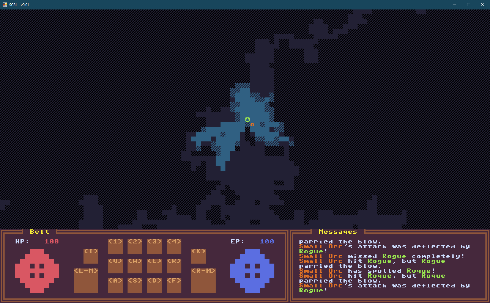

# SCRL
## A dotnet roguelike

SCRL stands for **SadConsole Roguelike**, since it's built on top of [SadConsole](https://github.com/SadConsole/SadConsole) and [Roguesharp](https://github.com/FaronBracy/RogueSharp). The original vision for this game was to be an action-oriented roguelike, not unlike the original Diablo -- so much so, in fact, the SCORLIB library was going to be able to read in the exact same flat file format to instantiate game data.

Game development is hard, and game design itself is even harder (if you want to make a good game). SCRL development started sometime in 2017, lasted a few hot months, and then petered off around NaNoWriMo season.

### What it looks like

### Gameplay
* **Arrow keys** or **numpad** can be used to navigate
* **WASD** moves the camera
* **Z, X, and C** generate new maps with different map-building algorithims (binary space partition, basic room gen, and random walk, respectively)

### Documentation
Some of the original design documentation is included in the static/docs folder:
* [Game Summary](static/docs/game_summary.md)
* [Data File Spec](static/docs/data_file_spec.md)
* [Religion](static/docs/religion.md)
* [MonStats Definition](static/docs/monstats_definition.md)